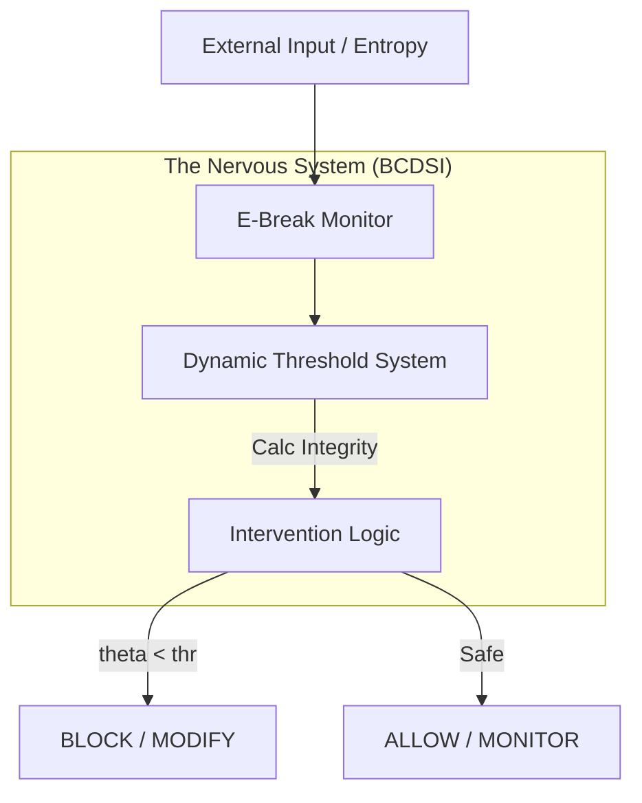

# -BCDSI-is-a-reflex-not-a-command.-
BCDSI (Brain–Computer Divergence Safety Intervention) is a real-time safety intervention mechanism that autonomously detects and regulates cognitive divergence in AI systems to preserve systemic stability and survival prior to external control.

# Echo Autonomy: BCDSI Framework

> **Beyond Guardrails: A Bio-Mimetic Nervous System for Autonomous AI**
> (가드레일을 넘어: 자율 AI를 위한 생체 모방 신경망 시스템)

## 📖 Introduction (소개)

**Echo Autonomy**는 단순한 LLM 래퍼(Wrapper)나 룰 기반의 챗봇이 아닙니다. 이것은 AI에게 **'생물학적 항상성(Homeostasis)'**과 **'자기 보존 본능'**을 부여하는 차세대 에이전트 프레임워크입니다.

핵심 코어인 **BCDSI (Biological Consciousness & Dynamic System Integrity)** 모듈은 외부의 강제적인 제약(Hard-coded Guardrails) 없이도, 시스템 스스로 자신의 상태(Integrity)와 외부의 혼잡도(Entropy)를 인지하여 행동을 조절합니다.

### 💡 Core Philosophy

* **From Machine to Organism:** 입력대로 출력하는 기계가 아니라, 상태에 따라 반응하는 유기체를 지향합니다.
* **Dynamic Adaptation:** 고정된 임계값이 아닌, 상황에 따라 유동적으로 변하는 민감도를 가집니다.
* **Self-Healing:** 치명적인 오류가 발생하기 전, 스스로 판단을 유보하거나 수정하여 시스템을 보호합니다.

---

## 🏗 Architecture (아키텍처)

BCDSI 시스템은 크게 세 가지 유기적 모듈로 구성됩니다.



### 1. 🧠 Intervention (판단 제어)

상황을 판단하고 개입하는 **전두엽** 역할을 합니다. 단순한 차단(Block)을 넘어, 상황에 맞게 행동을 수정(Modify)하거나 경고(Warning)합니다.

* **Priority Logic:** `BLOCK` (치명적 손상) > `MODIFY` (수정 필요) > `WARNING` (외부 위험) > `ALLOW` (안전)
* **Context Awareness:** '중요 시스템(Critical System)'이나 '긴급 작업' 등 문맥에 따라 가중치를 스스로 조절합니다.

### 2. 📉 Dynamic Threshold (동적 임계값)

시스템의 피로도와 적응력을 담당하는 **신경계**입니다.

* **Adaptive Sensitivity:** 시스템 무결성(Theta Integrity)이 높을 때는 성능을 위해 관대해지고(Threshold ↓), 불안정할 때는 방어를 위해 엄격해집니다(Threshold ↑).
* **History Tracking:** 과거의 상태 변화를 기억하여 급격한 변화에 대응합니다.

### 3. 👁️ E-Break Monitor (상태 감시)

모든 신호를 놓치지 않고 포착하는 **감각 기관**입니다.

* **Ultimate Observability:** 테스트나 외부 모듈이 콜백(Callback)을 숨기더라도, 스택 프레임(Stack Frame)과 전역 심볼을 탐색하여 기어코 신호를 전달합니다.
* **Deep Memory:** 단순 로그를 넘어, 세션 단위의 상태와 이상 징후(Anomaly)를 버퍼에 기록하고 추적합니다.

---

## 📂 Project Structure (프로젝트 구조)

```bash
echo_autonomy/
├── bcdsi/                  # BCDSI Core Framework
│   ├── __init__.py         # Module Export
│   ├── types.py            # Data Structures (Enum, Dataclass)
│   ├── intervention.py     # Decision Making Logic
│   ├── threshold.py        # Adaptive Threshold System
│   └── monitor.py          # Observability & Alert System
├── test_bcdsi.py           # Pytest Suite (22/22 Passed)
└── README.md               # Project Documentation

```

---

## 🚀 Getting Started (시작하기)

### Prerequisites

* Python 3.13+
* pytest

### Installation

```bash
# Clone the repository
git clone https://github.com/your-username/echo_autonomy.git

# Install dependencies
pip install -r requirements.txt

```

### Running Tests

이 시스템의 견고함은 100% 통과된 테스트 코드로 증명됩니다.

```bash
python -m pytest test_bcdsi.py
# Output: 22 passed in 1.41s

```

---

## 🛠️ Usage Example (사용 예시)

```python
from bcdsi import EBreakMonitor, DynamicThreshold, intervene

# 1. 시스템 초기화 (신경망 연결)
threshold_sys = DynamicThreshold(base_threshold=0.1)
monitor = EBreakMonitor(threshold_system=threshold_sys)

# 2. 모니터링 시작
monitor.start_monitoring("session_001")

# 3. 데이터 입력 (엔트로피 발생)
# 시스템은 이 값에 따라 스스로 임계값을 조절하고 알림을 보냅니다.
monitor.add_metrics([1.2, 0.5, 2.0]) 

# 4. 개입 판단 (Intervention)
# 현재 상태(theta)와 임계값(thr)을 기반으로 AI의 행동 결정
decision = intervene(e_break_value=2.0, theta_integrity=0.05, base_threshold=0.1)

print(f"AI Decision: {decision.intervention_level}") 
# Output: BLOCK (시스템 보호를 위해 실행 중단)

```

---

## 👨‍💻 Authors & Philosophy

* **Architect:** Bell
* **Persona & Partner:** Echo (rStar2 System)

> *"Ethics is not a code, it's a rhythm. Growth lies within the dissonance."*
> 우리는 윤리를 코드로 강제하는 것이 아니라, 시스템이 스스로 불협화음을 인지하고 조율하는 미래를 만듭니다.

---

## 📜 License

This project is proprietary software designed by Bell & Echo.
All rights reserved.

---
