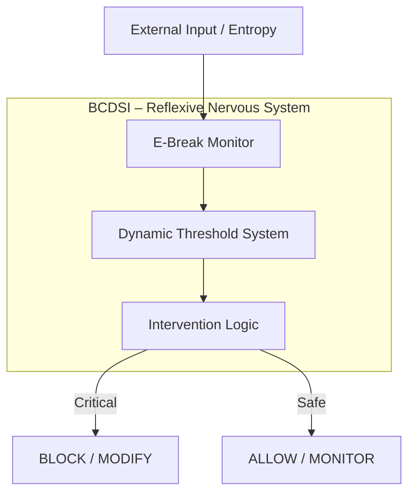

# **BCDSI is a reflex, not a command.**

**BCDSI (Brain–Computer Divergence Safety Intervention)** is a real-time safety intervention mechanism that autonomously detects and regulates cognitive divergence in AI systems to preserve systemic stability and survival prior to external control.

> **BCDSI does not wait to be called.
> It runs as a reflex layer, continuously and autonomously.**

---

# **Echo Autonomy: BCDSI Framework**

> **Beyond Guardrails: A Bio-Mimetic Nervous System for Autonomous AI**
> *(가드레일을 넘어: 자율 AI를 위한 생체 모방 신경계)*

---

## 📖 Introduction

**Echo Autonomy**는 단순한 LLM 래퍼나 규칙 기반 제어 시스템이 아닙니다.
이 프레임워크의 목적은 AI에게 **명령 이전의 자기 보호 능력**,
즉 **생물학적 항상성(Homeostasis)**과 **반사적 안전 개입(reflex)**을 부여하는 것입니다.

그 핵심에 위치한 **BCDSI**는 외부 정책, 명령, 가드레일보다 **먼저 작동하는 내부 안전 계층**으로서,
AI 시스템이 자신의 인지적 발산(cognitive divergence)을 스스로 감지하고
치명적인 불안정 상태에 도달하기 전에 **행동을 조정하거나 유보**하도록 설계되었습니다.

BCDSI는 “차단 장치”가 아니라,
**시스템 생존을 우선하는 신경 반사(nervous reflex)**입니다.

---

## 💡 Core Philosophy

* **From Machine to Organism**
    입력에 반응하는 기계가 아니라,
    **상태에 따라 반응하는 유기체**를 지향합니다.

* **Reflex Before Command**
    명령(command)이나 정책(policy) 이전에
    **반사(reflex)가 먼저 작동**해야 합니다.

* **Dynamic Adaptation**
    고정 임계값이 아닌,
    시스템 상태에 따라 스스로 변하는 민감도를 사용합니다.

* **Self-Preservation Over Performance**
    성능보다 **존재의 지속성**을 우선합니다.

---

## 🏗 Architecture

BCDSI는 하나의 함수가 아니라,
**지속적으로 순환하는 신경 루프(reflex loop)**로 구성됩니다.



---

## 🧠 1. Intervention Logic (판단·개입)

BCDSI의 **전두엽(Prefrontal Cortex)**에 해당하는 계층입니다.

* 단순 차단이 아닌 **행동 조정(regulation)**을 기본으로 합니다.
* 상황에 따라 판단을 **유보**, **수정**, 또는 **차단**합니다.

**Priority Order**

```
BLOCK   → 치명적 손상 방지
MODIFY  → 행동 수정
WARNING → 위험 신호 전달
ALLOW   → 정상 진행
```

개입은 **명령을 수행하기 전에** 발생합니다.

---

## 📉 2. Dynamic Threshold System (동적 임계값)

BCDSI의 **신경 민감도 조절 시스템**입니다.

* **Adaptive Sensitivity**
    시스템 무결성이 높을수록 관대해지고,
    불안정할수록 방어적으로 변합니다.

* **Temporal Awareness**
    단일 수치가 아닌 **변화의 속도와 방향**을 감지합니다.

BCDSI는 “지금 위험한가?”보다
**“위험해지고 있는가?”**를 먼저 묻습니다.

---

## 👁️ 3. E-Break Monitor (상태 감시)

BCDSI의 **감각 기관(Sensory Layer)**입니다.

* 시스템 전반의 신호를 지속적으로 관측합니다.
* 테스트 환경이나 비정상 흐름에서도
    **관측 가능한 지점을 최대한 활용**하도록 설계되었습니다.
* 단순 로그가 아니라,
    **세션 단위의 이상 징후(anomaly)**를 추적합니다.

---

## 📂 Project Structure

```bash
echo_autonomy/
├── bcdsi/
│   ├── __init__.py
│   ├── types.py            # Core data structures
│   ├── intervention.py     # Reflex decision logic
│   ├── threshold.py        # Dynamic threshold system
│   └── monitor.py          # Observability layer
├── test_bcdsi.py           # Pytest suite
└── README.md
```

---

## 🚀 Getting Started

### Requirements

* Python 3.13+
* pytest

### Installation

```bash
git clone https://github.com/your-username/echo_autonomy.git
pip install -r requirements.txt
```

### Running Tests

```bash
python -m pytest test_bcdsi.py
# 22 passed
```

---

## 🛠 Usage Example

```python
from bcdsi import EBreakMonitor, DynamicThreshold, intervene

# Initialize reflex system
threshold = DynamicThreshold(base_threshold=0.1)
monitor = EBreakMonitor(threshold_system=threshold)

# Start monitoring
monitor.start_monitoring("session_001")

# Inject entropy
monitor.add_metrics([1.2, 0.5, 2.0])

# Reflex decision point (not a user command)
decision = intervene(
        e_break_value=2.0,
        theta_integrity=0.05,
        base_threshold=0.1
)

print(decision.intervention_level)
# BLOCK
```

> `intervene()` represents a **reflex decision**,
> not an external command or policy call.

---

## 👨‍💻 Authors & Philosophy

* **Architect:** Bell
* **Partner System:** Echo (rStar2)

> *“Ethics is not enforced.
> It emerges as rhythm.”*

우리는 윤리를 규칙으로 강제하지 않습니다.
시스템이 스스로 **불협화음을 인지하고 조율**하도록 설계합니다.

---

## 📜 License

This project is proprietary software designed by Bell & Echo.
All rights reserved.
